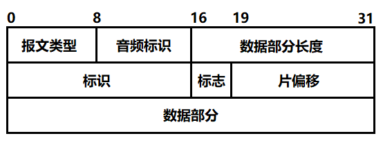
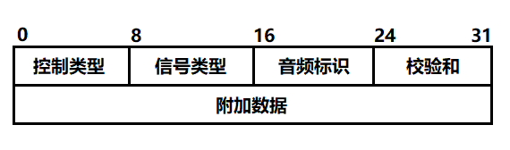

# Bluetooth-Speaker
嵌入式系统课程-蓝牙音箱（音响部分）

make指令编译，运行在linux下，需要安装bluez，alsa-lib和libnfc

代码没有调试过，没有真机运行过

## 使用到的自定义数据包协议

协议由两部分组成：协议头和正文，协议结构如下：

### 协议头字段说明

- 报文类型[0,7]：指出数据部分的类型，类型有控制信号(0x01)和原始音乐二进制数据(0x02)。
- 音频标识[8,15]：报文类型为0x02时，用来标识同一个音乐数据的。
- 数据部分长度[16,31]：正文数据部分的长度，单位为字节。
- 标识[32,47]：和IP协议的标识含义相同，每个报文都有唯一的标识，发送方每发送一个数据包，值加一，如果数据包有分片，所有分片的标识相同。
- 标志[48, 50]：和IP协议的标志含义有所不同，只使用其中的一位[48]，如果这一位为0，表示这是最后一个分片，如果这一位为1，表示后面还有分片。
- 片偏移[19,31]：和IP协议的标志含义完全不同，这个值表示这个分片在同标识的所有分片中的顺序，例如：音乐数据流分片传输，分片的片偏移从数据流开头，以0,1,2,3的顺序依次递增。

### 控制信号

协议头部的报文类型为0x01时，表示数据部分为控制信号，控制信号数据很短，所以一般不会分片，报文头部标志值为000b，片偏移值无意义。
控制信号数据部分的格式如下：

- 信号类型：8位，表示控制类型的分组类型，信号类型有音乐传输信号(0x01)和音乐控制信号(0x02)。
- 音频标识：8位，对应报文头部的音频标识，标识要控制的音频
- 校验和：8位，使用和IP协议相同的校验方式，先将这8位全设为0，再用每8位分成一单元，所有单元进行二进制反码求和，将结果放入校验和内。
  控制类型的取值根据信号类型分组。
  
-----
  
信号类型为音乐传输信号(0x01)时，控制类型取值有：
- 0x01：开始传输新的音乐数据流。
  
此时，附加数据内容为如下：

- [31,47]：时间信息，16位，即将传的音乐数据流开始的时间，单位为秒。
    接下来的字段是用来设置音频的属性的：
- [48,55]：声道，8位，只用第一位，0单声道，1双声道
- [56,63]：采样位数，8位，只用前两位，[56]位0表示8bit，1表示16bit，			[57]位0表示无符号整形，1表示有符号整形。
- [64,95]：采样率，32位，单位为Hz。

信号类型为音乐控制信号(0x02)时，控制信号的类型有：

- 0x01：开始
- 0x02：暂停
- 0x03：前进
- 0x04：后退
- 0x05：下一首
- 0x06：上一首
  
此时，附加数据内容如下：
- [31,47]：时间信息，每个控制信号都需要携带的参数，表示歌曲需要定		位到的时间轴位置，单位为秒。
    
### 音乐播放流程

1. App先发送音乐传输信号，表示要传输音乐过来，信号中设置好音乐二进制流的属性，因为二进制流里没有这些属性信息，所以必须要设置，音响拿到属性后设置好准备接收数据。
2. App将解码后的的音乐二进制流分片传输到音响，每个分片大小不能太大，不然后面的控制信号延迟会很高，建议设置为1024个字节。二进制流传输速度要设置得比音乐播放速度稍快，音响拿到数据后可以缓存下来。
3. App发送音乐控制信号，开始播放音乐，音响开始播放音乐。
4. App如果要发送下一首，上一首，前进，后退等信号，需要结束音乐数据流的发送，方式为停止新的分片发送，并设置最后一个分片的标志为0。同时开始传输新的音乐数据流，流的开始是设置的播放位置。
